# Kessly: Supply Chain Management System for Wine Distribution for IBL

Kessly is a robust and modern Supply Chain Management System tailored for wine distributor companies. It streamlines operations from inventory and sales to HR and analytics, helping businesses optimize their workflows and scale efficiently.

---

## Features

- **Inventory Management**: Track wine products, suppliers, and stock levels.
- **Customer & Sales Management**: Manage customer data, orders, invoicing, and sales analytics.
- **Finance Module**: Monitor expenses, revenue, and financial reports.
- **Human Resources (HR)**: Oversee employee records, branches, and HR analytics.
- **Reporting & Analytics**: Access dashboards and export comprehensive business reports.
- **Settings & Customization**: Configure company settings, permissions, and workflow automation.

### Email Features

- **Transactional Emails**: Custom HTML email templates for welcome, verification, and admin notifications
- **Email Analytics**: Track open rates, delivery status, and user engagement
- **Queue Processing**: Asynchronous email sending for better performance
- **Email Templates**: Professional, branded email templates with tracking pixels
- **SMTP Integration**: Brevo (Sendinblue) SMTP for reliable email delivery

### Email Commands

```bash
# Test email configuration
php artisan app:test-email user@example.com

# Process email queues
php artisan queue:process-emails

# View email statistics
php artisan tinker
>>> \App\Models\EmailTracking::getStats()
```

### Email Types

- **Welcome Email**: Sent to new users upon registration
- **Admin Notification**: Alerts administrators about new user registrations
- **Verification Email**: Confirms user account approval
- **System Notifications**: Various automated system communications

---

## Technology Stack

### Web Frameworks
- **Laravel** (PHP)
- **Livewire**

### UI Frameworks
- **Tailwind CSS**
- **Bootstrap** 5.3.0
- **Animate.css**

### JavaScript Frameworks
- **GSAP** 3.11.4
- **Alpine.js** 3.14.9
- **toastr** 2.1.4

### JavaScript Libraries
- **Axios**
- **Slick**
- **Lodash** 4.17.21
- **jQuery UI** 1.12.1
- **jQuery** 3.6.0
- **Swiper**
- **Masonry**
- **Isotope**
- **AOS**

### Font Scripts
- **Font Awesome** 6.0.0
- **Bootstrap Icons**
- **Bunny Fonts**
- **Google Font API**

### Miscellaneous
- **PWA (Progressive Web App)**
- **Webpack**
- **Popper.js**

### Web Servers
- **Microsoft HTTPAPI** 2.0

### Programming Languages
- **PHP** 8.4.0

### CDN Providers
- **Cloudflare**
- **Bunny CDN**
- **cdnjs**
- **jQuery CDN**
- **jsDelivr**

---

## Demo Screenshots

Experience the platform visually:

| Analytics Dashboard | Branches Overview | Customer Management |
|---------------------|-------------------|--------------------|
| 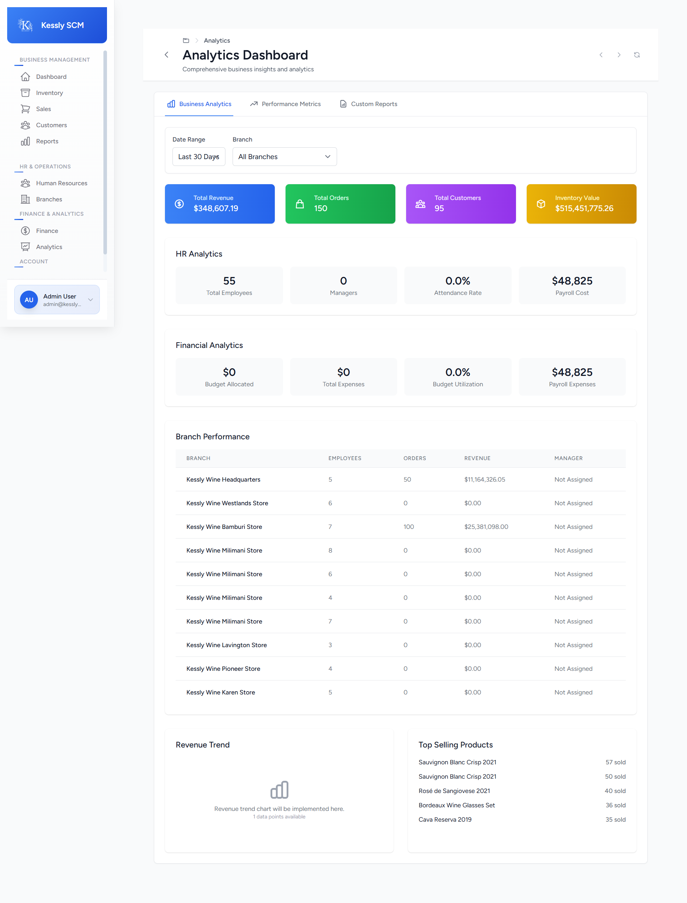 | 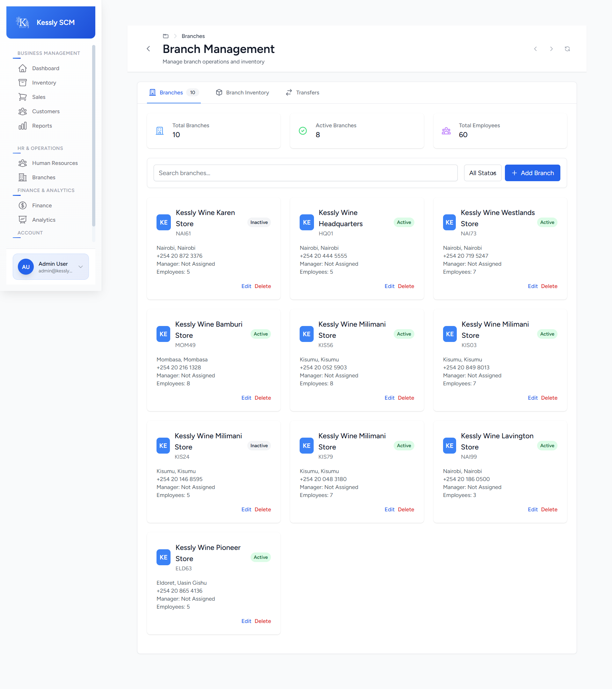 | 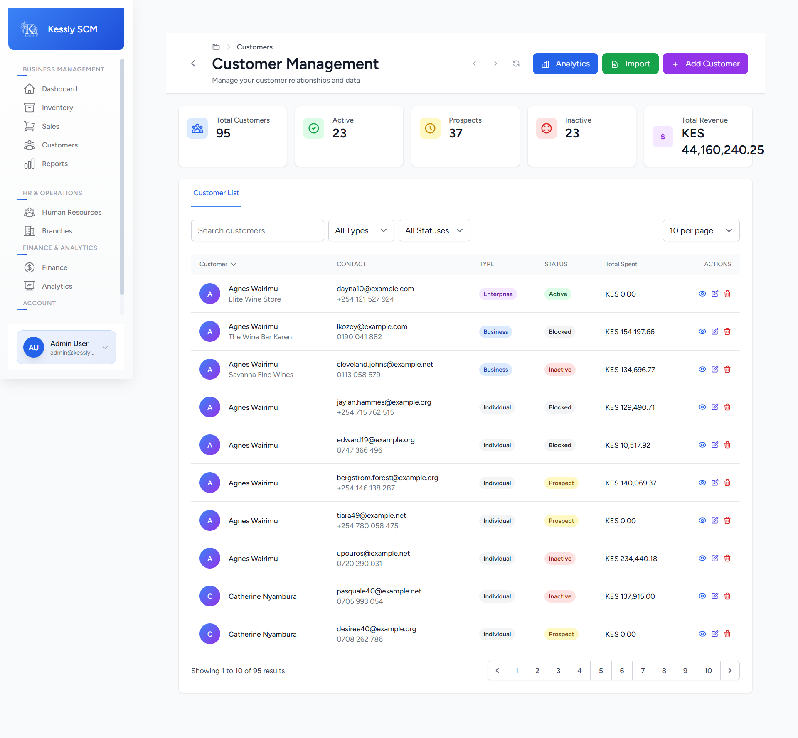 |

| Main Dashboard | Finance Module | HR Module |
|----------------|---------------|-----------|
| 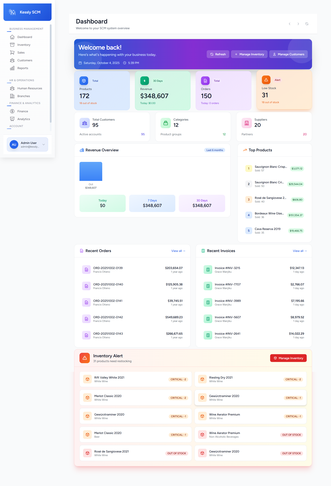 | 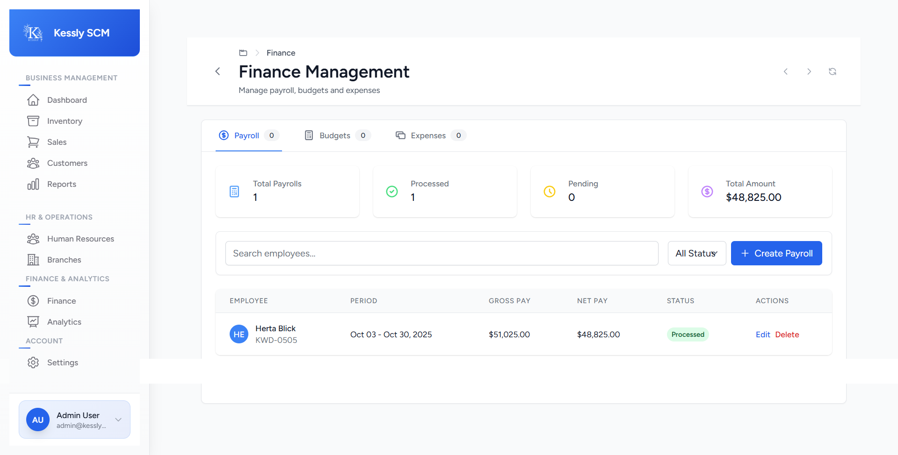 | 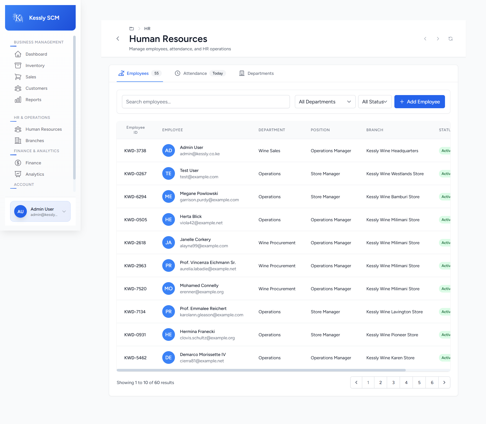 |

| Inventory Management | Payroll Additions | Reporting |
|---------------------|------------------|-----------|
| 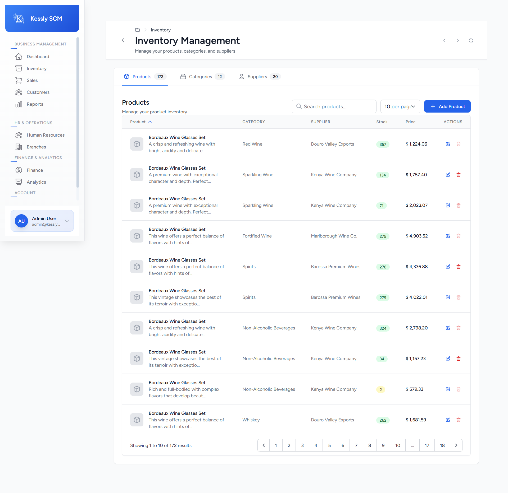 | 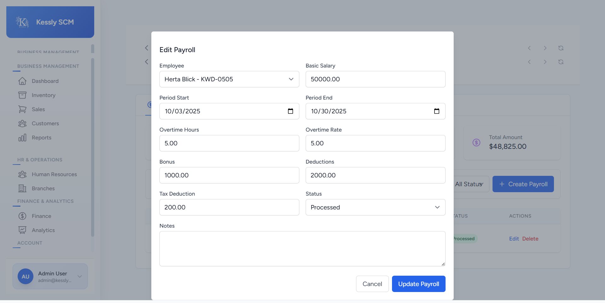 | 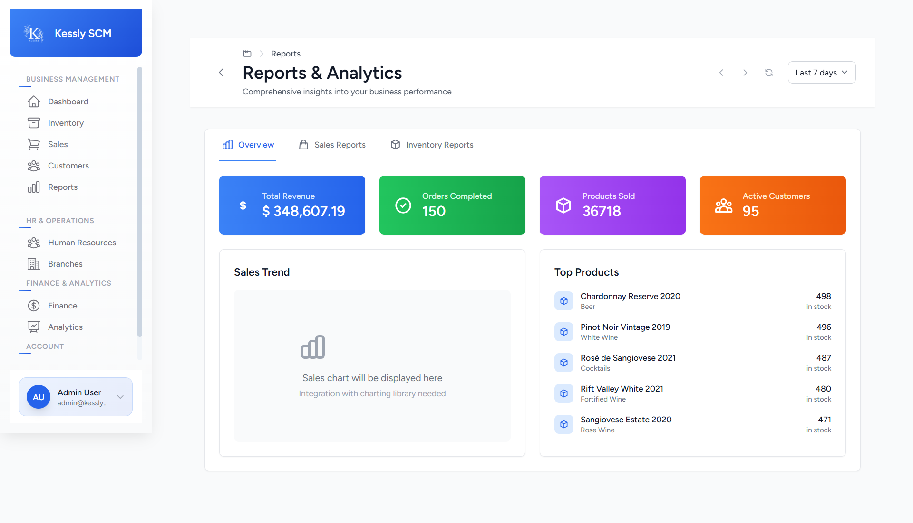 |

| Sales Overview | System Settings |
|---------------|-----------------|
| 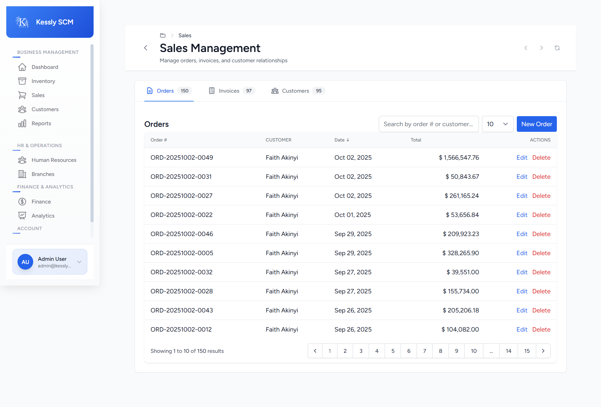 | 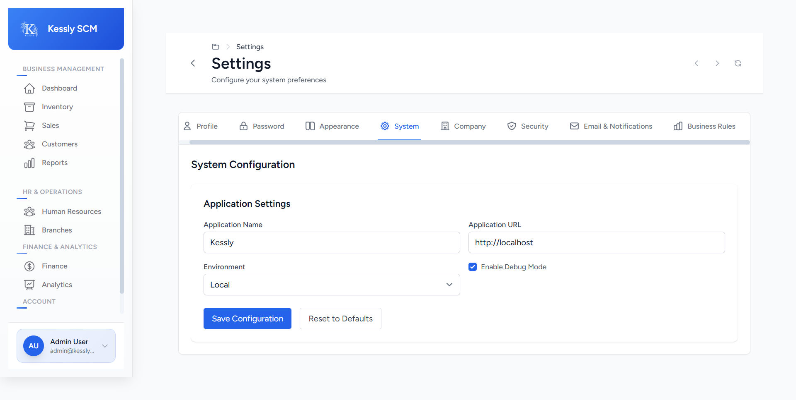 |

---

## Getting Started

1. **Clone the repository**
   ```bash
   git clone https://github.com/PHPDEV-OPS/Kessly.git
   cd Kessly
   ```
2. **Install dependencies**
   ```bash
   composer install
   npm install
   ```
3. **Configure environment**
   - Copy `.env.example` to `.env`
   - Set database and other credentials

   ```bash
   php artisan key:generate
   php artisan migrate
   ```

4. **Configure Brevo Email (Optional)**
   - Sign up for a [Brevo](https://www.brevo.com/) account
   - Get your SMTP credentials from the Brevo dashboard
   - Update your `.env` file with Brevo settings:

   ```env
   MAIL_MAILER=brevo
   BREVO_SMTP_HOST=smtp-relay.brevo.com
   BREVO_SMTP_PORT=587
   BREVO_SMTP_ENCRYPTION=tls
   BREVO_SMTP_USERNAME=your_brevo_smtp_username
   BREVO_SMTP_PASSWORD=your_brevo_smtp_password
   MAIL_FROM_ADDRESS=your-email@yourdomain.com
   MAIL_FROM_NAME="${APP_NAME}"
   ```

   - Test email configuration:
   ```bash
   php artisan app:test-email your-email@example.com
   ```

5. **Configure Email Queues (Recommended)**
   - Start the email queue processor for better performance:
   ```bash
   php artisan queue:process-emails
   ```
   - Or run in background:
   ```bash
   php artisan queue:work --queue=default --sleep=3 --tries=3
   ```

6. **Run the application**
   ```bash
   php artisan serve
   ```

---

## Contributing

We welcome contributions! Please fork the repository and submit a pull request.

1. Fork the repo
2. Create your feature branch (`git checkout -b feature/AmazingFeature`)
3. Commit your changes (`git commit -m 'Add some AmazingFeature'`)
4. Push to the branch (`git push origin feature/AmazingFeature`)
5. Open a Pull Request

---

## License

This project is licensed under the MIT License.

---

## About

Kessly is developed and maintained by Weiszer, Klynne and Robi for IBL 
*Empowering wine distribution businesses through technology.*
